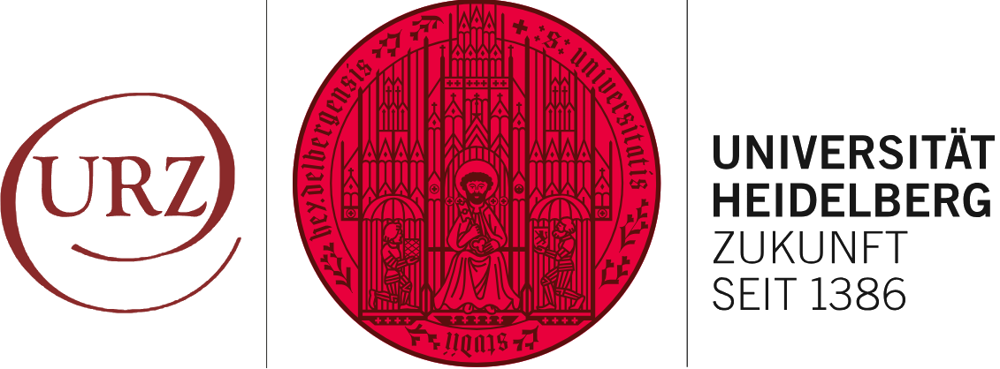
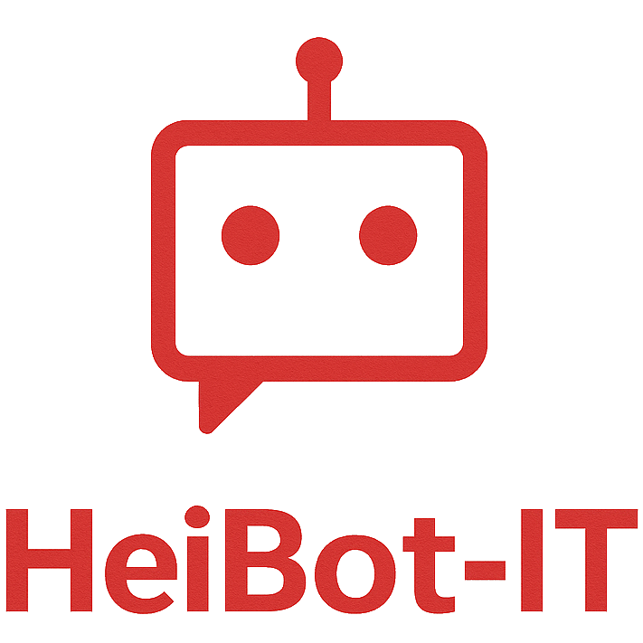

<p align="center">
  
  
</p>

# URZ RAG Platform

This repository contains the University of Heidelberg URZ chat experience. It now includes a
platform skeleton that combines the existing Tailwind React chat UI with an Ollama-backed RAG
API, container orchestration, and space for future ingestion and worker services.

## Repository Layout

```
├── app.py                      # Legacy Flask entry point (preserved)
├── backend/                    # FastAPI + Celery platform scaffold
│   ├── app/
│   │   ├── api/                # Route modules (auth, crawl, docs, chat, admin)
│   │   ├── core/               # Config, database, security, SSE, MinIO helpers
│   │   ├── ingest/             # Crawling + ingestion pipeline placeholders
│   │   ├── models/             # SQLAlchemy ORM models
│   │   ├── rag/                # Retrieval and Ollama client helpers
│   │   ├── workers/            # Celery configuration + tasks
│   │   └── main.py             # FastAPI application entry point
│   ├── migrations/             # Alembic environment + pgvector bootstrap migration
│   └── requirements.txt        # Backend dependencies
├── docker-compose.yml          # Local orchestration for all services
├── Dockerfile.api              # Backend image (FastAPI + Celery)
├── Dockerfile.frontend         # Frontend image (Vite dev server)
├── frontend/                   # React + Tailwind chat UI
├── index_store/                # Existing FAISS index data
├── requirements.txt            # Legacy Flask requirements
└── .env.example                # Environment variable template
```

## Local Development with Docker Compose

The platform runs entirely through Docker Compose. The first run requires populating an `.env`
file from the provided template and then starting the stack.

### 1. Configure Environment Variables

Copy the example environment file and adjust values if needed:

```bash
cp .env.example .env
```

The defaults target local containers: PostgreSQL with the pgvector extension, Redis, MinIO,
and an Ollama runtime.

### 2. Build Images

```bash
docker compose build
```

### 3. Launch the Stack

```bash
docker compose up
```

The command starts the following services:

| Service    | Description                            | Port |
|------------|----------------------------------------|------|
| `frontend` | React + Tailwind chat UI               | 3000 |
| `api`      | FastAPI RAG backend                    | 8000 |
| `worker`   | Celery worker for async tasks          | n/a  |
| `db`       | PostgreSQL 16 with pgvector extension  | 5432 |
| `redis`    | Redis message broker / cache           | 6379 |
| `minio`    | S3-compatible object storage           | 9000 (API), 9001 (console) |
| `ollama`   | Local model runtime                    | 11434 |

### 4. Smoke Test

Once the containers are healthy, verify the backend health endpoint:

```bash
curl http://localhost:8000/admin/health
# {"status":"ok"}
```

You can then visit the chat UI at [http://localhost:3000](http://localhost:3000).

## Next Steps

The backend scaffold contains placeholders for authentication, ingestion pipelines, Celery tasks,
and retrieval orchestration. Future PRs will flesh out these components, wire the FastAPI backend
into the existing frontend, and migrate the legacy Flask features to the new architecture.
